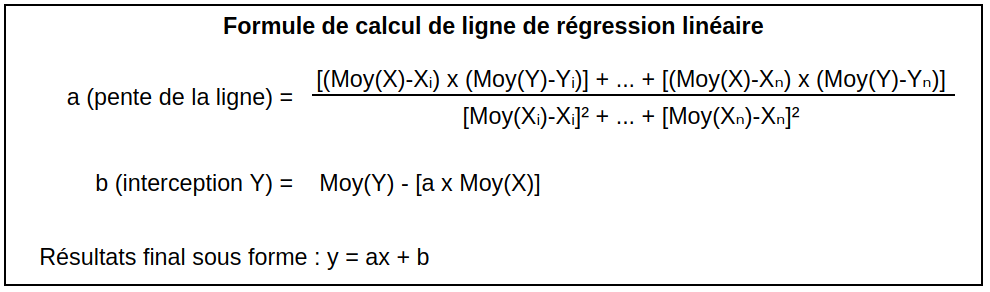

# Guess-it-2

### Descriptif
_______
Programme qui calcul retourne une plage pour prédire le prochain numéro. <br>
La prédiction utilise la régréssion linéaire pour prédire la plage de résultat 
<br>
</img>

### Usage
_______
```go
node server.js
```

### Authors
_______
+ Fabien Olivier