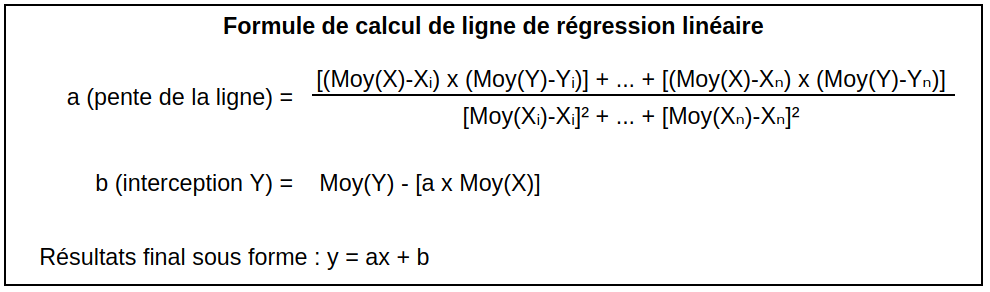
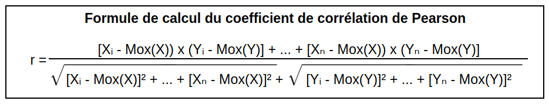

# Linear Stats

### Descriptif
_______
Programme qui calcul la `ligne de régression linéaire` et le `coefficient de corrélation de Pearson`.
Le fichier `data.txt` est utilisé pour récupérer les coordonnées Y, les coordonnées X elles correspondent à l'incrémentation des données au fur et a mesure que Y récupéré dans le fichier.

<table align= "center">
    <thead>
        <th align= "center" colspan="2" >Formule de calcul utilisé</th>
    </thead>
    <tbody>
        <tr>
            <td></td>
            <td></td>
        </tr>    
    </tbody>
</table>

### Usage
_______
```go
go run . data.txt
```

### Authors
_______
+ Fabien Olivier [Gitea](https://zone01normandie.org/git/folivier)
