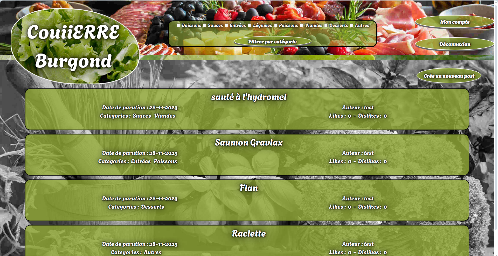

# Forum

### Descriptif
_______
Le projet consiste à créer un forum ou les utilisateurs peuvent s'enregistrer. 
Les utilisateurs connectés peuvent créer des posts et mettre des commentaires sur les posts et peuvent `liker` ou `disliker` les posts ou commentaires. 
Les utilisateurs non connectés peuvent simplement lire les commentaires et les posts. 
Un système de filtre est également présent (par catégorie de posts, par post créé et par post `liker`).




### Usage
______
Sans le dockerfile
```go
go run ./cmd/main.go
```

Avec le dockerfile
```sh
sudo docker image build -t forum <PATH DU PROJET>
```

### Dépendence
_______
Le serveur est en Go version 1.18. Utilise les bibliothèques suivante :
- [standard Go](https://golang.org/pkg/)
- [sqlite3](https://github.com/mattn/go-sqlite3)
- [bcrypt](https://pkg.go.dev/golang.org/x/crypto/bcrypt)
- [UUID](https://github.com/gofrs/uuid)

### Authors
_______
+ Fabien OLIVIER
+ Antoine SALAUN
+ Alexandre VALIN
+ Armand AUVRAY
