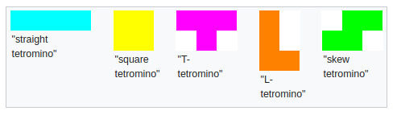
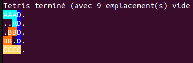

# Tetris Optimizer

### Descriptif
_______
Le programme permet, à partir de tetromino (pièce de Tetris) de remplir automatiquement une grille contenant le moins d'espace possible.<br>
Pour indiquer au programme les tetrominos à utiliser, il faut créer un fichier `.txt` qui sera placé dans le dossier `Fichier_Tetrominos` est les tetrominos seront identifier dans un quadrillage de 4 par 4 par des `#`, les espaces vide étant identifié par des `.`

Liste des cinq tetrominos possibles<br>



Position possible des tetrominos pouvant être utilisés<br>


Exemple de format de tetrominos pour créer un fichier `.txt` :
```
....
.##.
.##.
....
```
```
##..
.#..
.#..
....
```

### Example of result
_______
<table align= "center">
    <thead>
        <th align= "center">Exemple 1</th>
        <th align= "center">Exemple 2</th>
    </thead>
    <tbody>
        <tr>
            <td></td>
            <td></td>
        </tr>    
    </tbody>
</table>

### Usage
_______
```go
go run . "nom du fichier"
```

### Authors
_______
+ Fabien Olivier

